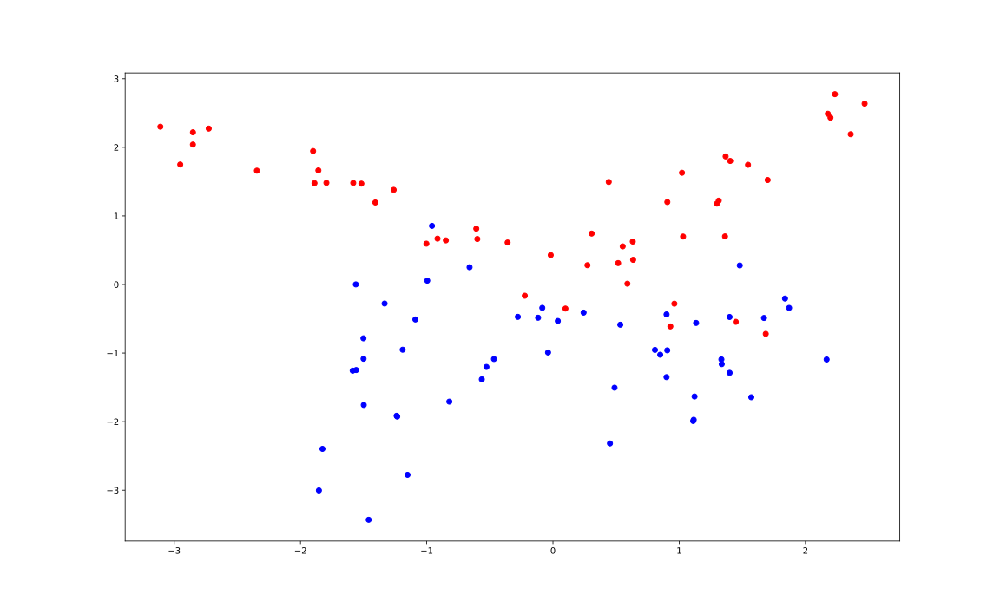

# Explainable AI

Prendiamo come esempio un problema in cui
ogni dato in ingresso ha solo 2 feature e 2
possibili classi.

A questo punto ci interessa allenare un
modello per riuscire a classificare anche dati
non ancora analizzati, i quali saranno poi
il focus dell'analisi.

A noi non interessa se la classificazione sia
corretta o meno, ci interessa sapere _"perché"_
i nuovi dati sono stati classificati in quel
modo.

## Approccio

Una volta classificati i nuovi dati, viene
svolta un'analisi locale su ciascuno di
questi. Una volta scelto il punto da analizzare
si generano dati _sintetici_ vicini a quel
punto, i quali, per essere di buona qualità,
devono essere simili al punto considerato, non
uguali ma neanche troppo distanti.

L'obbiettivo è sia capire perché il
classificatore ha dato determinati risultati,
sia capire quali sono i valori che le feature
di quello speicifico individuo dovrebbero
avere per essere classificato nell'altro modo.

Diventa quindi necessario, per ogni classe
del problema andare a costruire una popolazione
di punti sintetici che ci dice come fare ad
essere classificato in un altro modo.

A questo punto è possibile andare ad usare un
metodo di exaplainable AI su ognuno dei punti
per riuscire a capire quali feature influenzano
maggiormente determinate scelte di
classificazione piuttosto che altre.
