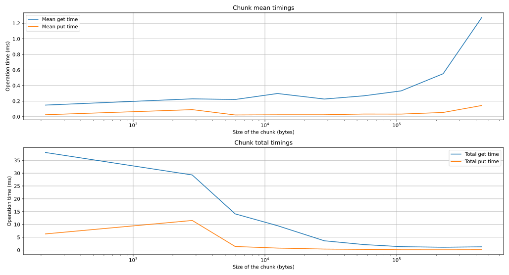

# Analisi multiprocessing

Di seguito alcune considerazioni sull'utilizzo
del multiprocessing per la parallelizzazione di
un algoritmo genetico.

## Motivazioni

L'utilizzo del modulo `multiprocessing` è ciò che
viene considerato lo standard per il calcolo
parallelo in Python, soprattutto se si parla di
task CPU bound.

Permette di aggirare il problema introdotto dal
GIL, il quale non permette il classico paradigma
multithread, possibile in altri linguaggi come C o
C++.

Tramite multiprocessing è dunque possibile non
scendere a compromessi in quanto ad espressività
del codice. Il programmatore è libero di scrivere
il suo algoritmo genetico utilizzato tipi e
strutture dati native di Python e, se necessario
può ricorrere a librerie di terze parti senza
problemi.

### Problematiche

Il multiprocessing di contro non è la cosa più
leggera che ci sia. Di certo non è possibile
pensare ad un approccio in cui i processi vengono
creati e distrutti ad ogni iterazione, in quanto
si genererebbe del dell'overhead sicuramente non
trascurabile.

La scelta di creare un pool di processi worker che
rimane in vita dall'inizio alla fine
dell'esecuzione è dunque una scelta quasi obbligata
e che introduce la necessità di un qualche
meccanismo di sincronizzazione per avviare e
mettere in attesa i processi.

L'altro potenziale limite è l'assenza di memoria
condivisa. Non è dunque possibile avere strutture
dati condivise tramite puntatori o definite
globalmente a cui ogni processi può accedere. Anche
qui la scelta di condividere parti della struttura
dati tramite qualche meccanismo di streaming dati
è praticamente obbligata.

#### Memoria condivisa

Esiste la possibilità di creare un blocco di
memoria condivisa che risiede al di fuori di ogni
worker e al quale è possibile accedere in modo
diretto come si farebbe tramite multithreading.

Ho trovato tuttavia questo meccanismo molto
limitante per l'espressività che vorrebbe in
qualche modo garantire la libreria. Il motivo è
che per riuscire a accedere direttamente al blocco
di memoria lo si deve fare tramite oggetti che
supportano il **Buffer Protocol** di Python, come
ad esempio _numpy array_ o _bytearray_.

Questo limita molto i tipi e le strutture dati
che si vogliono impiegare e ci spinge ad un
approccio più classico in cui possiamo manipolare
solo array numerici o simili.

Non sarebbe quindi possibile avere cromosomi
dalla struttura complessa ma soprattutto
personalizzata.

## Modello di calcolo parallelo

Il modello di calcolo proposto si offre di operare
in parallelo nelle fasi di crossover, mutazione e
valutazione.

Una volta selezionati gli individui per la
riproduzione, si suddivide la lista che li contiene
in $W$ chunk uguali, dove $W$ è il numero di
processi worker. Ciascun chunk viene poi inviato
ai worker.

Per la condivisione ho optato per un meccanismo
basato su code (`multiprocessing.Queue`) di
comunicazione. Ogni processo possiede due code, una
per la ricezione dati, l'altra per l'invio.

Le code permettono di implementare in modo molto
semplice il paradigma _produttore-consumatore_,
fornendo due metodi principali (`put` e `get`)
che permettono rispettivamente di

- Inserire un elemento nella coda. Se questa è
  piena il processo si blocca finché non vi è
  uno slot libero.
- Estrarre un elemento dalla coda. Nel caso in cui
  questa sia vuota ci si blocca in attesa che un
  elemento venga inserito.

Per velocizzare ulteriormente l'invio e la
ricezione dati ho fatto uso della libreria
`asyncio`, la quale, tramite la sintassi
`async`/`await` permette di effettuare operazioni
I/O bound in modo asincrono.

### Pipeline di ricezione

Una prima implementazione consisteva semplicemente
nell'inviare per intero il chunk di struttura dati
al worker. Questo però potrebbe costituire un
ostacolo alle performance nel momento in cui la fase
di calcolo parallelo non è particolarmente pesante
o quando la popolazione presa in esame risulta
particolarmente grande.

Per mitigare il problema è possibile suddividere
ognuno dei chunk da inviare ai worker in ulteriori
_sub-chunk_. In questo modo, il worker potrebbe
ricevere i _sub-chunk_ asincronamente mentre
elabora quelli già ricevuti.

## Prestazioni

Il modello di calcolo, per quanto semplice, sotto
le giuste ipotesi offre lo speed up sperato (o
comunque ci si avvicina molto).

Per valutare la bontà del modello ho preso in
considerazione il tempo necessario a

- inserire un singolo individuo in coda.
- effettuare le operazioni di crossover, mutazione
  e valutazione per un singolo individuo.
- effettuare le due operazioni precedenti ma per
  un gruppo di individui.

I test svolti prendono in considerazione una
popolazione di $10.000$ individui, tutti
identificati da cromosomi composti da $100$,
$200$ e $500$ interi. Di seguito una tabella che
mostra le dimensioni degli oggetti.

| cromosoma | individuo (byte) | popolazione (MB) |
| :-------: | :--------------: | :--------------: |
|    100    |       1048       |      10.08       |
|    200    |       1784       |      17.09       |
|    500    |       4344       |      41.51       |

### Operazioni sulla coda

Il primo test è stato effettuato sui tempi medi
di inserimento ed estrazione di un singolo
individuo nella coda. Ho scelto di considerare il
tempo medio e non il peggiore dato che le una stessa
operazione in Python potrebbe impiegare tempi anche
molto differenti. Il tempo più frequente rimane
comunque quello medio.

| tempo medio (ms) |   100   |   200   |   500   |
| :--------------: | :-----: | :-----: | :-----: |
|       put        | 0.00345 | 0.00344 | 0.00373 |
|       get        | 0.03291 | 0.03479 | 0.05174 |
|    put + get     | 0.03636 | 0.03822 | 0.05547 |

A seguire il tempo necessario ad inserire ed
estrarre uno per volta tutti e $10.000$ gli
individui dalla coda.

| tempo totale (ms) |  100   |  200   |  500   |
| :---------------: | :----: | :----: | :----: |
|        put        | 34.54  | 34.38  | 37.33  |
|        get        | 329.09 | 347.85 | 517.37 |
|     put + get     | 363.64 | 382.23 | 554.71 |

Infine il tempo necessario ad inserire ed
estrarre l'intera popolazione di $10.000$
individui in un colpo solo.

| tempo (ms) |  100   |  200   |  500   |
| :--------: | :----: | :----: | :----: |
|    put     | 0.0063 | 0.0071 | 0.0072 |
|    get     | 0.6508 | 0.4106 | 0.5223 |
| put + get  | 0.6571 | 0.4177 | 0.5296 |

Come possiamo vedere è chiaro il vantaggio nel
gestire più individui alla volta. Rimane ancora
da valutare se abbia senso inviare al worker il suo
chunk di popolazione tutto intero o diviso in più
pezzi di modo da implementare una pipeline e
riuscire ad iniziare il calcolo parallelo prima
che ogni worker riceva il suo chunk di popolazione
per intero.

Di seguito due grafici rappresentanti

1. Il tempo medio necessario ad inserire e
   rimuovere chunk di grandezza differente dalla
   coda.
2. Il tempo totale necessario ad inserire e rimuovere
   tutta la popolazione suddivisa in chunk.

Notiamo subito che in entrambi i casi il tempo di
inserimento in coda rimane quasi costante, a prescindere
dalla dimensione dei chunk. Probabilmente questo è
dovuto al fatto che l'operazione viene svolta in modo
asincrono.

Per quanto riguarda invece il tempo medio di estrazione
di chunk dalla coda, possiamo vedere come questo cresca
con il crescere della dimensione del chunk.

Come era invece possibile aspettarsi, il tempo totale
di estrazione dell'intera popolazione risulta più
rapido quando i chunk sono più grandi.

#### Sintesi

Fare assunzioni sul tempo di inserimento ed
estrazione su e dalla coda non ha molto senso dato
che potrebbero entrare in gioco ottimizzazioni
interne che non è possibile controllare.

Sarebbe più ragionevole considerare tempi medi
per riuscire ad ottimizzare

### Calcolo parallelo

La valutazione della fase di calcolo parallelo
dipende molto dal problema. Le fasi di crossover e
mutazione sono in genere abbastanza leggere,
soprattutto se paragonate alla valutazione della
fitness.

### Valutazioni di gruppo

Ogni individuo occupa uno spazio di $48$ byte e per
inserirlo nella coda sono necessari in media
$0.9 \; \mu s$. Per inserirne $10.000$ sono stati
necessari circa $15 \; ms$.

Per elaborare un individuo mediamente sono
necessari $0.8 \; ms$, sono stati necessari
invece circa $19$ secondi per valutarne $10.000$.

<!-- Ricontrollare gli ordini di grandezza -->

Se la valutazione della fitness di ogni individuo è
abbastanza pesante da coprire l'overhead dovuto
alla condivisione di quell'individuo con il worker
di anche solo un ordine di grandezza temporale, lo
speed up sarà quello sperato (in particolare vicino
ad un fattore $W$).
