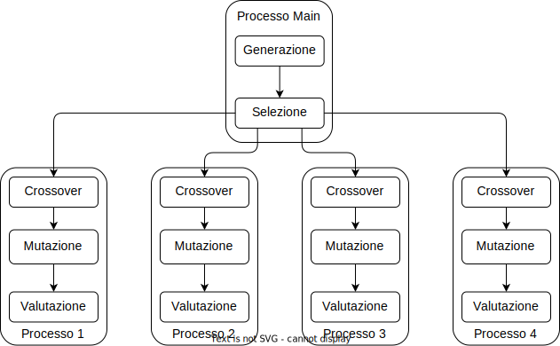

# Modello parallelo

Per il momento la parte di maggiore interesse da
parallelizzare è la fase in cui l'algoritmo compie
il crossover, la mutazione e la valutazione dei
nuovi individui.

Il modello a cui ho pensato è molto semplice ma
dovrebbe ridurre un po' di overhead dovuto ad
eventuali sincronizzazioni tra i processi.

Considerando anche che le tre fasi vengono ripetute
ad ogni iterazione, se si creassero e
distruggessero continuamente i processi si
genererebbe un overhead troppo grande. Dobbiamo
quindi implementare un soluzione in cui i processi
sono attivi per tutta la durata dell'algoritmo e
tramite un qualche meccanismo di sincronizzazione
vengono messi in attesa o risvegliati.

## Suddivisione del carico

Come suddisivisione del carico di lavoro per il
momento pensavo ad un qualcosa di molto semplice
in cui le strutture dati vengono suddivise
equamente tra i processi in base al numero dei
processi stessi.

Per determinare il numero di processi in gioco
bisogna tenere di conto anche il numero di core
fisici (e logici) che si hanno ha disposizione per
non creare overhead dovuto allo scheduling.

Dato che le tre fasi citate poco fa vengono
eseguite in sequenza, ho pensato che sarebbe
inutile creare un pool di processi per il
crossover, uno per la mutazione e uno per la
valutazione. Per intenderci un qualcosa di
questo genere:

Si aggiungerebbe dell'overhead necessario alla
sincronizzazione dei vari processi che gestiscono
fasi diverse dell'algoritmo, che a mio parere
si potrebbe benissimo evitare accorpando le tre
fasi in un'unico processo come mostro di seguito:

In questo modo si hanno solo due fasi di
sincronizzazione, la prima quando si inizia la fase
in parallelo e la seconda quando si termina e si
devono unire i risultati ottenuti per la fase di
rimpiazzo.

Una volta che i processi terminano il loro lavoro
devono essere messi in attesa e risvegliati solo
al momento opportuno.

## Strutture dati condivise

Per capire quali siano le strutture dati condivise
tra i vari processi ho considerato il seguente
modello:

In azzurro le funzioni e gli operatori genetici,
in verde i dati generati ad ogni fase
dell'algoritmo.

Per il momento non mi soffermo
sull'implementazione di tali strutture, quello
che ci interessa è capire quando una struttura
dati è richiesta dai processi che operano in
parallelo e quando invece è il processo principale
a richiedere dati elaborati in parallelo.

Come si può vedere l'unica struttura dati non
richiesta tra i vari processi è quella che contiene
gli individui selezionati. In realtà c'è da capire
se la formazione delle coppie può avvenire in
parallelo o meno. In caso affermativo non si
avrebbe più necessità di memorizzare le coppie ma
si rendere accessibile a tutti i processi la
struttura dati contenente gli individui
selezionati.

## Condivisione risorse

Per la condivisione delle risorse abbiamo due
meccanismi principali offerti dal modulo
`multiprocessing`: il primo è una comunicazione
tramite `Pipe`, mentre il secondo permette
l'allocazione di memoria condivisa tra i vari
processi: `SharedMemory`.

Ci sarebbe anche la possibilità di utilizzare
strutture dati condivise come `Array`,
`ShareableList` e altre ma per il momento non ho
approfondito l'argomento dato che accettano solo
tipi primitivi o, se si volesse rendere possibile
la condivisione di oggetti definiti dall'utente,
si dovrebbe ricorrere al modulo `ctypes` con cui
però non riesco ad ottenere la libertà che vorrei
in termini di API lato utente.

### Pipe

Per quanto riguarda la prima opzione, lo schema
rimarebbe grosso modo lo stesso poiché le frecce
tra i vari processi andrebbero a rappresentare il
trasferimento dei dati tramite pipe.

Il grosso problema di questo approccio è l'overhead
generato dalla comunicazione dei dati ad ogni
iterazione.

Sicuramente implementare invio e ricezione dei dati
in modo asincrono potrebbe aiutare a migliorare le
performance. Da esplorare la possibilità del
multithreading in questa fase dato che per le
operazione I/O bound si dovrebbe riuscire a
sperimentare dell'effettivo parallelismo.

### Memoria condivisa

Si tratta di un approccio molto più simile a quello
che si avrebbe in ambito multithread.

Non si dovrebbe avere alcun overhead poiché non vi
è trasferimento dati ma accesso diretto alla
memoria condivisa

Il problema qui si potrebbe avere nel caso in cui
si abbiamo strutture dati condivise che cambiano
dinamicamente, in particolare se crescono di
dimensione. Per allocare memoria condivisa dobbiamo
fornire il numero esatto di byte che si
intende allocare. Se la struttura dati cresce
sarebbe necessario riallocare la memoria.

#### Subinterpreters

Ancora da esplorare l'opzione `subinterpreters` che
dovrebbe fornire meccanismi di sharing della
memoria più semplici e flessibili.

## Pipeline

Per il momento il lavoro svolto in parallelo da
ognuno dei processi è questo

La fase di crossover genera un insieme di nuovi
individui i quali poi vengono mutati in gruppo e
valutati. In linea teorica si potrebbe rendere più
efficiente il tutto implementando una pipeline per
le tre fasi in questo modo:

La differenza qui sta nel fatto che sono i singoli
individui a passare da una fase all'altra
permettendo, una volta a regime, di valutare un
individui contemporaneamente alla generazione di e
alla mutazione di altri individui.

Dico "in linea teorica" perché una pipeline
richiede una fase di sincronizzazione e si deve
capire se questa fase risulta _piccola_ rispetto
all'effettivo calcolo da eseguire. In caso
contrario si genera un overhead che andrebbe solo a
degradare le prestazioni.

Ammesso che sia effettivamente efficiente come
soluzione si deve tenere di conto del numero di
core disponibili.
